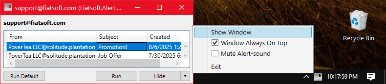
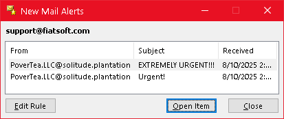

# [](https://fiatsoft.com)

## Fiatsoft.Alert.Grid

Hosted at https://github.com/Fiatsoft/Fiatsoft.Alert.Grid

## Switching to Thunderbird and miss Outlook's "New Mail Alerts" box?



**An enhanced replica of the Outlook's "New Mail Alerts" box.**

That's what you get with this project, combined with use of [FiltaQuilla's](https://addons.thunderbird.net/en-us/thunderbird/addon/filtaquilla/) "run command" message filter (integration guide [below](#📧-use-in-thunderbird)), which is also flexible enough to handle alerts from any other scripted source.

For light-weight alerts *that stay on the screen* and are easy to manage; never miss something important again, while supporting open-source!

## 🌟 Features

- **Specify shell action-commands for each message**: Such as opening the message in Thunderbird.
- **Specify a default action-command for all messages**: For more advanced usage, expands the currently selected `@Item@` as JSON.
- **Specify topic-name for multiple alert-queues**: by `-topic` argument.
- **Supports environment-variable expansion**: Including `%DATE_%` and `%TIME_%` if missing from your environment.
- **Recall Alert window from notification icon**: Dismiss easily.
- **Resizable Alert window**: More flexible display versus Outlook 2019.

## 🔧 Installation

### Installing Release Binaries

Requires [.NET 8.0 runtime](https://dotnet.microsoft.com/en-us/download/dotnet/thank-you/runtime-desktop-8.0.11-windows-x64-installer?cid=getdotnetcore).

Choose either running the installer or extracting the portable archive, both available at https://github.com/Fiatsoft/Fiatsoft.Alert.Grid/releases

### Building From Source

Requires [Visual Studio 2022](https://visualstudio.microsoft.com/thank-you-downloading-visual-studio/?sku=Community&channel=Release&version=VS2022&source=VSLandingPage&cid=2030&passive=false#installvs) and [.NET 8.0 sdk](https://dotnet.microsoft.com/en-us/download/visual-studio-sdks).

1. Clone the repo:

   ```cmd
   git clone https://github.com/Fiatsoft/Fiatsoft.Alert.Grid.git
   ```

1. Build:
   - Open Fiatsoft.Alert.Grid.sln
   - Switch to `Release` configuration
   - Copy \bin\Release\net8.0-windows to your installation directory

## 📧 Use in Thunderbird

Requires [FiltaQuilla](https://addons.thunderbird.net/en-us/thunderbird/addon/filtaquilla/) (and obviously [Thunderbird](https://thunderbird.net))

1. Create message-filter:
   - Click Tools > Message Filters
   - Select desired mailbox in `Filters for`
   - Click `New`

2. Specify message-filter:
   - Specify a name, like "Fiatsoft.Alert.Grid via FiltaQuilla"
   - Ensure "Getting New Mail" is checked and "Match all of the following" is specified
   - Set "Status" "is" "New"
   - Under Perform these actions select "Run Program" (available only if [FiltaQuilla](https://addons.thunderbird.net/en-us/thunderbird/addon/filtaquilla/) is installed)
   - Enter a command to pass the message to Fiatsoft.Alert.Grid.exe compatible with FiltaQuilla (comma,seperated) syntax, using `support@fiatsoft.com` as an example (replace with the name of your inbox); and adjust the path to your installed Fiatsoft.Alert.Grid.exe and Thunderbird.exe as necessary:

   ```bash
   C:\Program Files\Fiatsoft.Alert.Grid\Fiatsoft.Alert.Grid.exe,-mode,push,-Topic,Thunderbird: support@fiatsoft.com,-sound,%windir%\media\Alarm03.wav,-defaultAction,"C:\Program Files\Mozilla Thunderbird\thunderbird.exe",From,@AUTHOR@,Subject,@SUBJECT@,-action,"C:\Program Files\Mozilla Thunderbird\thunderbird.exe" mid:@MESSAGEID@
   ```


3. Don't forget to install the required [.NET 8.0 runtime](https://dotnet.microsoft.com/en-us/download/dotnet/thank-you/runtime-desktop-8.0.11-windows-x64-installer?cid=getdotnetcore) if necessary (running `Fiatsoft.Alert.Grid.exe` from the Start-menu will prompt to install as needed), otherwise the Thunderbird message filter will fail silently.

It is recommended to make use of the default Created column to display and sort by date, instead of FiltaQuilla's unsortable @DATE@, unreadable @DATEINSECONDS@ and the injected %DATE_% %TIME_% environment variables; by doing nothing (i.e., relying on default behavior) and by *not bothering to include* `Recieved "%DATE_% %TIME_%"` or similar.

## 💻 Use in Command-line

```cmd
Usage: Fiatsoft.Alert.Grid.exe -mode <push|pull> < [-topic "topic name"] [{column-key column-value}... |  -title {"Title"}  |  -width {width|300} | -height {height|300} | -size {widthxheight|300x300} | -action {command} | -defaultaction {command @ITEM@} | -schema {['allowed','columns']} | -sort {+Column|-Column|Column} | -dateformat {O|"MM/dd/yyyy HH:mm:ss"} ] > | [-h|--h|-help|--help|/?|-?|/h|/help] 

 Segments will have \n, \t, etc unescaped and %variables% expanded
```

Runs as a daemon/messenger. The daemon listens for alert-items, and the messenger sends them. Although there is clear separation and order between these modes & options, the program is designed to correct improper usage. The mode is specified with `-mode` as `push` (messenger) or `pull` (daemon). Each daemon listens for messages belong to one `-topic`, and no other daemon can listen to that same `-topic` (would exit silently).

You are expected to launch a daemon before you start sending messages to it but for convivence if a messenger detects the absence of the daemon it will attempt to launch one per normal before sending its message (using inferred or user-specified options in a sub-process).

All arguments are optional; messengers must have `-topic push` and (usually) column-value/key-value pairs.

**Common Arguments:**

- `-mode`: Can be `push` or `pull` for a daemon/messenger modes, respectively, as documented below (optional: defaults to `pull`).
- `-topic`: The name of alert-topic to listen or send to. Normally limited to 220 characters, per Windows OS limitations on the length of pipe names for IPC, or 240 characters minus the length of the application's executable file-name; topic-names longer than this limit may be truncated (shortened), which may lead to duplicated/shared topics and daemon-instances to (without warning/exception) exit silently (optional: defaults to `Default` with special UI-cue).
- `-h|--h|-help|--help|/?|-?|/h|/help`: Display usage information above, and will ignore all other arguments (optional).
   
**Daemon Arguments:**

- `-schema`:
  The accepted column-names from the received Alerts to display, specified as a JSON-array (optional: defaults to inferring schema from first received Alert).
- `-title`:
  The title of the alert window which (optional, with default).
- `-width`:
  The width of the alert window (optional).
- `-height`:
  The height of the window (optional).
- `-size`:
  The width and height of the window in `WidthxHeight` format (optional: supersedes -width/-height arguments).
- `-defaultAction`:
  The command to run with clicking on the `Run Default` button; expands the `@Item@` macro into the currently selected Alert (as JSON).
- `-alarm`:
  The path of the sound file to play when items arrive (optional: defaults to `%windir%\\media\\Alarm03.wav`).
- `-sort`:
  The direction (as +/-) and column-name of the initial sort by which to apply to grid; a special `Created` is provided and recommended for sorting purposes (optional: defaults to `+Created`).
- `-dateFormat`:
  The date format to apply to the 'Created' default-column; use "O" for locale-neutral timestamp or, for example, "MM/dd/yyyy HH:mm:ss" for en-US locale/culture (optional: defaults to `"G"`, the system default).
- `-hideCreated`:
  Hide the above-previous 'Created' column.

**Messenger Arguments:**

- `-action`: A command to run with clicking on `Run` associated with this item (optional).
- `-json`: Accept the Alert-item's column/value pairs as a JSON string represented by the next argument (optional).
- `["COLUMN NAME" "COLUMN VALUE"]...`: Any other string or token is treated as a Column name (key) paired with the following string or token as its value; anywhere in the command they are encountered. If the `COLUMN NAME` is not found in the daemon's `-schema` array then it and it's value are ignored. If any of these pairs are found within a `-mode pull` command then they will used in a 'pre-scripted' alert to be loaded with the initial window. Any repeated `COLUMN NAME` will over-write any earlier associated `COLUMN VALUE`.

Above arguments can be specified in any order and can be mixed with those from any other category to support maximum failover from novice/incorrect usage.

### Examples

#### As a listener (daemon)

```cmd
Fiatsoft.Alert.Grid.exe -mode pull -Topic "Thunderbird: support@fiatsoft.com" -schema "[""From"", ""Subject""]" -sound "%windir%\media\Alarm03.wav" -defaultAction """C:\Program Files\Mozilla Thunderbird\thunderbird.exe"" -folder "imap://support@fiatsoft.com/Inbox" -sort +Created
```

#### As a messenger

```cmd
Fiatsoft.Alert.Grid.exe -mode push -Topic "Thunderbird: support@fiatsoft.com" -action """C:\Program Files\Mozilla Thunderbird\thunderbird.exe"" mid:a3a5ee0f-8275-e09e-4cbf-59183a4a5805@fiatsoft.com" From example@example.example Subject "Love Letter"
```

## 📖 Technical Notes

Works on the basis of per-topic pipes and Mutex/EventWaitHandle, named as derived from `-topic` argument and executable-name. 

Renaming `Fiatsoft.Alert.Grid.exe` could get around `-topic` collisions, but configuration-settings will still be read from orginal `Fiatsoft.Alert.Grid.dll.config`.

## 📐 Design Notes

Based on design of Microsoft Outlook's "New Mail Alerts"/'New Item Alert' window, which is commonly programmed to display upon receiving new mail and remains on top of the Desktop until dismissed (unlike the modern Widows notification system, which offers only an un-numbered notification icon for missed alerts):  



## 💛 Acknowledgments

This project makes use of the following third-party libraries/tools:

1. [WPF NotifyIcon](https://github.com/hardcodet/wpf-notifyicon)
   - **License**: [MIT License](https://github.com/hardcodet/wpf-notifyicon/blob/master/LICENSE)
   - **Description**: A library for easily adding system tray icons to WPF applications.
2. [Newtonsoft.Json](https://www.nuget.org/packages/Newtonsoft.Json)
   - **License**: [MIT License](https://github.com/JamesNK/Newtonsoft.Json/blob/master/LICENSE.md)
   - **Description**: A popular JSON framework for .NET, widely used for parsing and serializing JSON data.
3. [WixToolset.UI.wixext](https://www.nuget.org/packages/WixToolset.UI.wixext/5.0.2?_src=template)
   - **License**: [Microsoft Reciprocal License (MS-RL)](https://github.com/wixtoolset/wix4/blob/master/LICENSE.TXT)
   - **Description**: An extension for the Wix Toolset providing useful UI components for WiX installers.
4. [Wix Toolset (CLI and Core Libraries)](https://wixtoolset.org/)
   - **License**: [Microsoft Reciprocal License (MS-RL)](https://github.com/wixtoolset/wix4/blob/master/LICENSE.TXT)
   - **Description**: A set of tools for creating Windows Installer packages, including the Wix CLI, tools for creating MSI, and more.
5. [Wix Extensions by FireGiant](https://firegiant.com/)
   - **License**: Typically Proprietary (Refer to [Firegiant's](https://firegiant.com/) official documentation for specifics)
   - **Description**: FireGiant offers extended functionality for the Wix Toolset, such as enhanced features for custom UI components, advanced editing, and more.

## 💤 Notices

See [LICENSE.md](LICENSE.md) for licensing information.

Copyright (c) 2024-2025 `fiatsoft.com.`.
